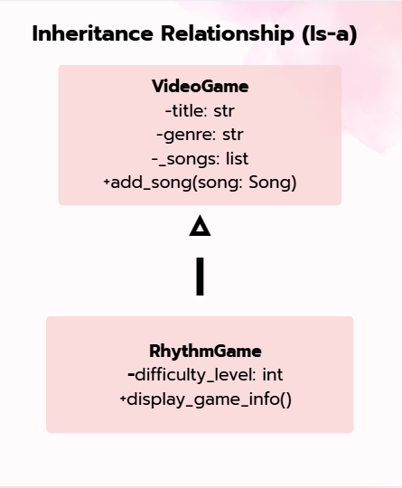
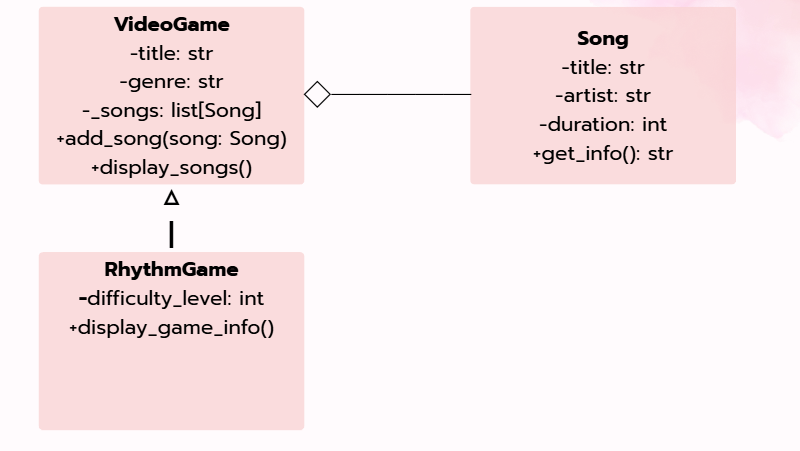
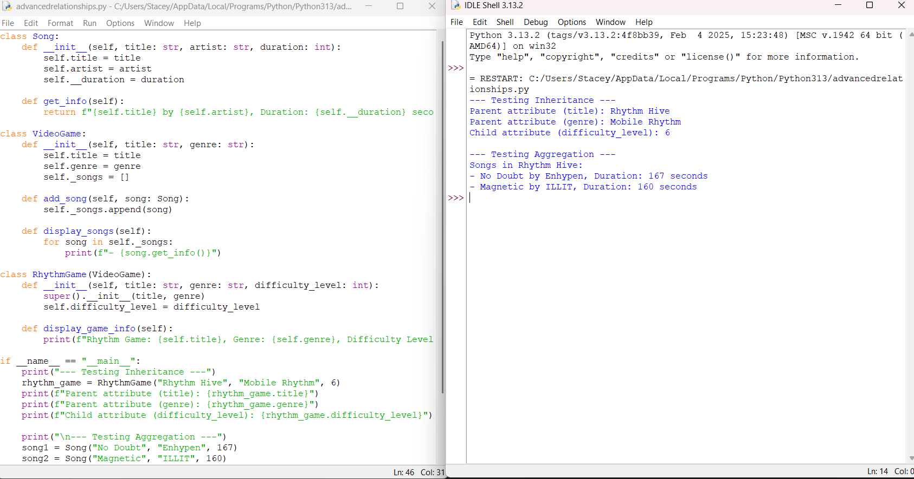
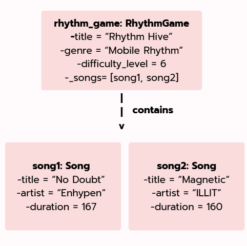

# Advanced Class Relationships

## Previous Activities

[classAttrib](classAttributesMethods.md)

[classRel](classRelationships.md)

## Existing System Description:
- In Part 3, I built a video game tracking setup wherein a VideoGame class manages a bunch of Song objects. So basically, it acts as a kind of playlist container for soundtracks, background sounds/tunes, and audio effects using a one-to-many (1:0..*) multiplicity.

## Inheritance Relationship
Parent: VideoGame

Child: RhythmGame

Explanation: A RhythmGame is like a specific kind of video game, so it IS-A VideoGame. It gets to borrow the attributes like title and genre, and helpful methods like add_song() and display_songs().

## Inheritance UML

## Composition/Aggregation
Relationship: Aggregation (Weak HAS-A)

Explanation: The connection between the games and the Song class is an aggregation. SO, this means that individual Song items are made completely on their own and therefore can exist independently even if they aren't added to any game's playlist/track.

## Advanced UML Diagram

## Python Implementation
[Source Code](advancedRelationships.py)

## Test Run

## Object Diagram

## Reflection
1. Why did you choose your inheritance relationship? Explain why your child class is a type of your parent class.
- I decided to choose Rhythm game as the child class of VideoGame because a rhythm game IS-A specialized type of video game. It shares properties like the title and genre.

2. How did inheritance reduce duplicate code? Identify attributes or methods that were reused.
- Using inheritance saved me from rewriting all the initialization code and song list functions from scratch. By calling super().__init__, my child class automaticall gets all the core attributes and methods without me having to copy-paste them.

3. Why is your HAS-A relationship Composition or Aggregation Explain the lifecycle relationship between the two objects.
- It is an aggregration because the Song objects are created on their own and can therefore exist independently. If the game is closed or a song is removed from the playlist, the song objects don't get destroyed.

4. What is the difference between Association from Part III and the advanced relationship you implemented?
- In Part III, I connected separate classes together using association and multiplicity like storing lists objects to show a 'has-a' link. But in part IV, I use a parent-child ('is-a') relationship so that a specilized class can automatically share and reuse the core code and attributes from a parent class.

5. How does your design follow the DRY principle?
- It follows the DRY or the 'Don't Repeat Yourself' rule by putting all the shared game detail/attributes and methods into the parent class, so the child classes can just inherit them instead of rewriting the same code over and over again.