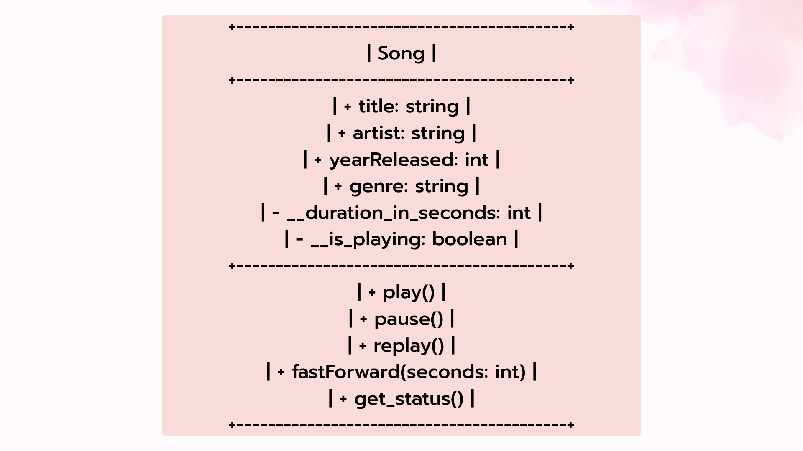
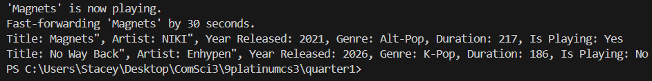
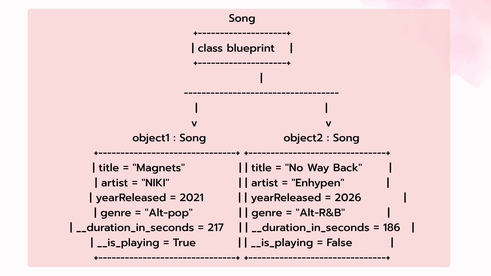

# Class Attributes and Methods

## Previous Design
Link to my previous activity:
[classObjectUML.md](classObjectUML.md)

## Design Revision
Changes I made:
- I added visibility modifiers ("+" for public and "-" for private)
- I added a private boolean attribute (__is_playing) so that I can track if the song is currently active/playing or if it is paused
- I converted durationInSeconds into a private attribute (__duration_in_seconds)
- I added a public method (get_status())

## Visibility Decisions
| Attribute | Data Type | Visibility | Reason |
|---|---|---|---|
|title|string|Public|The title is public so that it is openly accessible to users so they can freely view the name of the song/track|
|artist|string|Public|The name of the artist must be public because it is a basic data and information that users need to see when browsing or listening to songs|
|genre|string|Public|Genre should be public because it makes it easy to access for categorization.|
|yearReleased|int|Public|The release year of a song should be a public information that users can freely view along with the song's title and artist|
|__duration_in_seconds|int|Private|The duration in seconds should be made private to prevent accidental mistakes and to control how the data is viewed|
|__is_playing|boolean|Private|It should be private so other parts of the program cannot change it directly. This forces the code to use methods like play() or pause() to handle the state changes|

## Updated UML Class Diagram

## Python Implementation
[View Python Source](classImplementation.py)

## Test Run

## Object Diagram

## Analysis

### Why did you make your chosen attribute private?
- I made attributes like __duration_in_seconds and __is_playing private so that they are safe from accidental changes that could be made outside the code.

### Which method changes the state of your object?
- The play(), pause(), and replay() methods changes the state of the object by modifying the private __is_playing attribute.

### How did your two objects demonstrate that instances are independent?
- It is independent because when I called song1.play() only the song 1's playing status changed to True while song 2's playing status remain as False. This shows that each object has their own unique data and behavior.

### What is the difference between your class diagram and your object diagram?
- The class diagram represents the general blueprint which shows the attributes and methods, while the object diagram shows the real world instances that is created from the blueprint and is filled with specific data values.