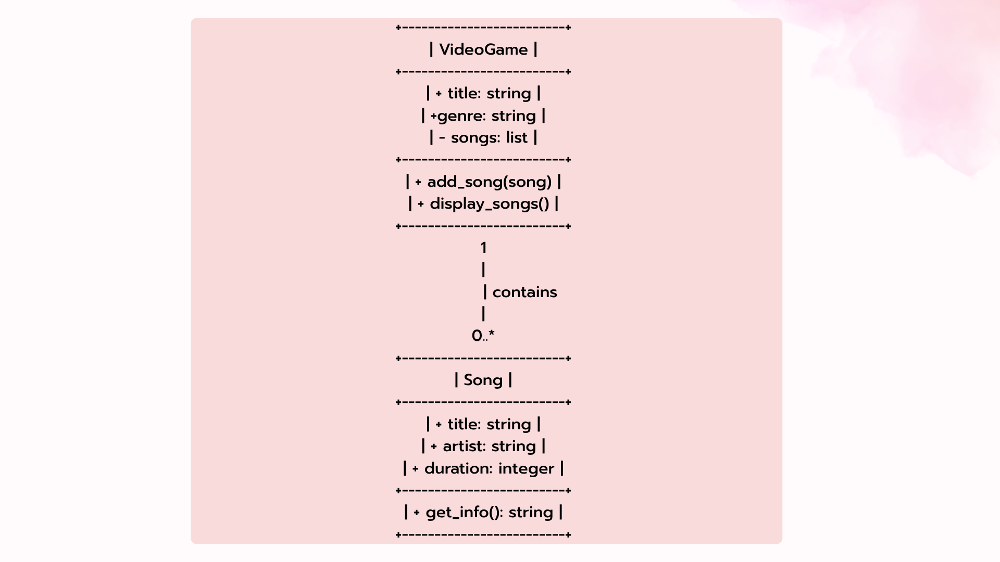
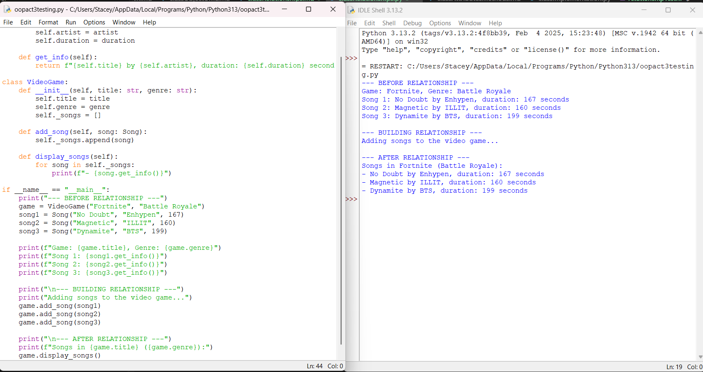
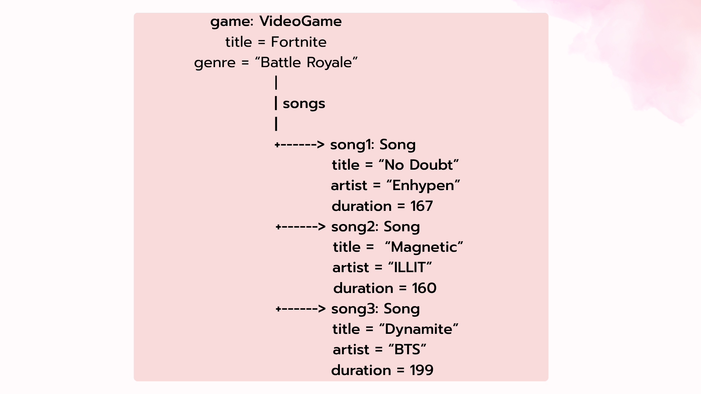

# Class Relationships: Association and Multiplicity

## Previous Work
[Part I - Classes and Objects](classObjectUML.md)
[Part II - Class Attributes and Methods](classAttributesMethods.md)

## Existing Class
Class: Song
Description: A song is a short piece of music that includes music, lyrics, and voice. It is considered a major form of art and is created from a blend of emotion, experiences, as well as cultural traditions

## New Related Class
Class: VideoGame
Description: Video games are games that involves interaction with a user interface or input device. 

## Association
Relationship: VideoGame contains Song 
Explanation: They are related to each other as songs are used as an audiovisual effect in a game. Songs are important in video games because it shapes player emotions and acts as an interactive storytelling tool. 

## Multiplicity
Multiplicity: 1 : 0..*
Explanation: It is a one-to-many (1:0..*) multiplicity because a single video game can have zero to multiple song objects for soundtracks, audio-visual effects, and other purposes. 

## UML Class Relationship Diagram

## Python Implementation
[View Python Source](classRelationships.py)

## Test Run

## Object Relationship Diagram

## Analysis
### What is the association between your two classes?
- The association between VideoGame class and Song class represents a relationship wherein a single video game can hold zero to multiple soundtracks. The VideoGame class acts as the container for a game soundtrack. Meanwhile, the Song class acts as an independent audio track that can be associated with the game in the VideoGame class.
### What multiplicity did you choose and why?
- The multiplicity I chose is 1 to 0..* because a single video game can contain zero to a large collection of soundtracks. A 1:1 relationship would be quite restrictive as most games feature multiple songs. Meanwhile, a 0..* allows a newly created game to start with having zero songs (or an empty list) to multiple songs added.
### How did you implement the relationship in Python?
- I implemented it by using a private list attribute (_songs) inside my VideoGame class. When individual Song objects are created independently, they are passed into the game using the add_song method. The add_song method appends each song object in the private list so that the game can manage them.
### Why did you store an object reference instead of copying its data?
- Because storing an object reference instead of copying its data keeps everything connected and avoids redundancy. If a song's information changes, I only need to change it in the original Song object. Like when displaying the song/soundtrack, the game accesses the song's data directly through its reference rather than the data copied.
### If your relationship uses many, why is a list appropriate?
- A list is appropriate and important when a relationship uses many because it provides a collection that can grow as objcts/items are added. In what I did, the _songs list does not hold copied text strings, but it contains the actual Song object references. This lets me loop through the list and call methods (like get_info) on each item easily.